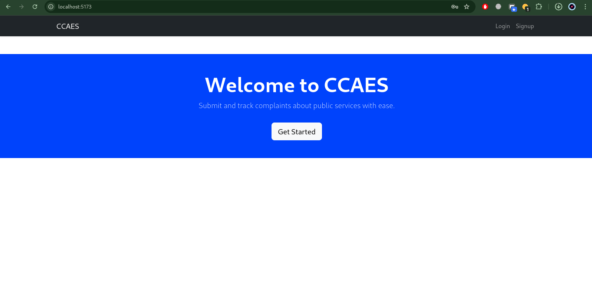
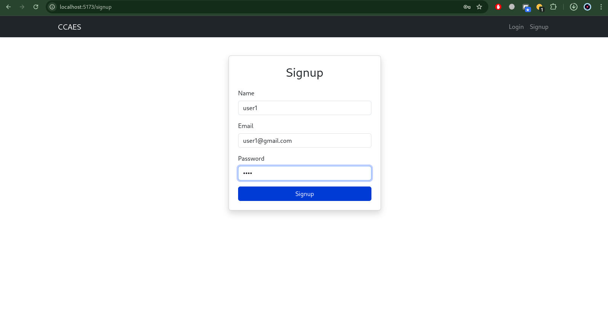
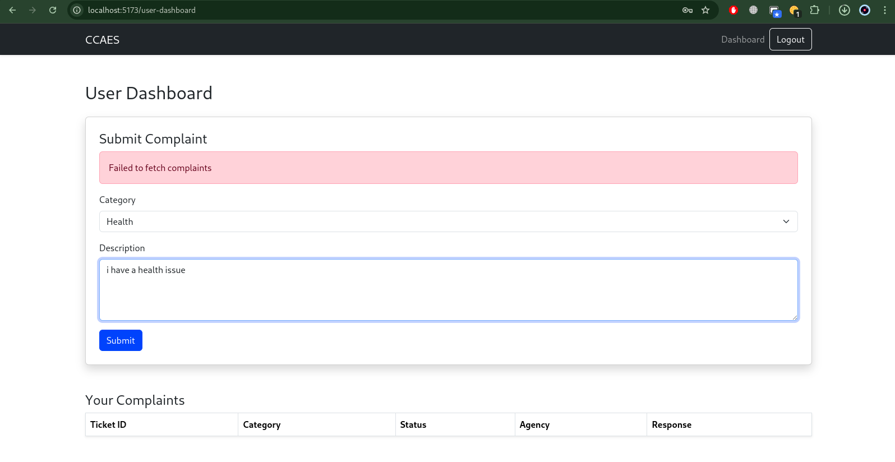
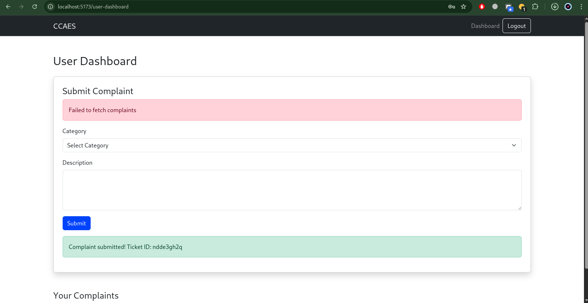
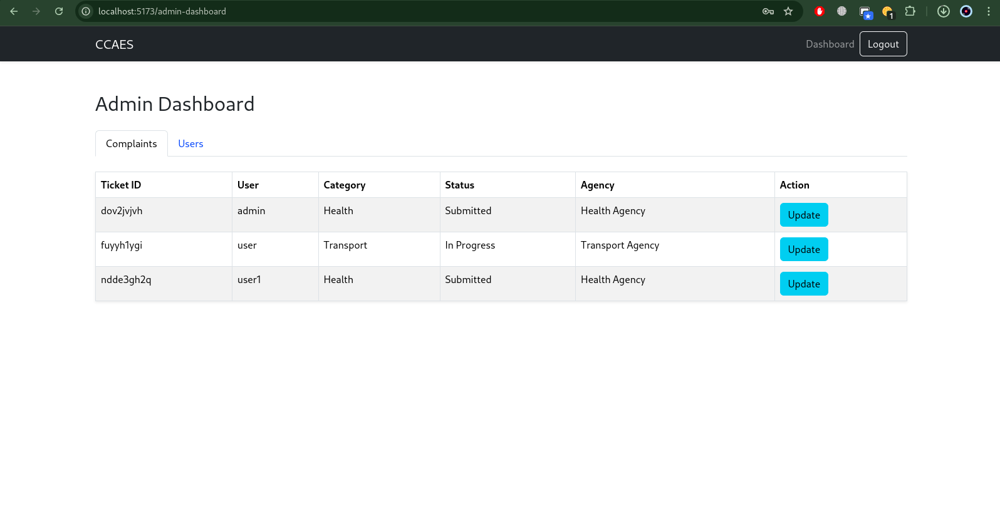
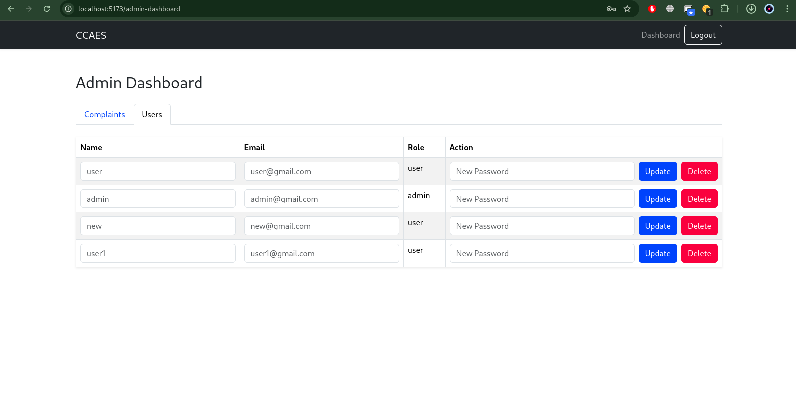

# CCAES - Citizen Complaints and Engagement System

A modern web application for citizens to submit and track complaints about public services, with admin features to manage complaints and users.

## Tech Stack
- **Frontend**: React, Bootstrap 5, React Router
- **Backend**: Node.js, Express, MongoDB
- **Authentication**: JWT

## Features
- **User**: Signup, login, submit complaints, track status, view history.
- **Admin**: Manage complaints (view, update status/response), manage users (view, update name/email/password, delete).
- **UI/UX**: Responsive design with Bootstrap, intuitive navigation.

## Setup
1. Clone the repo: `git clone https://github.com/pacyuzu16/ccaes.git`
2. **Backend**:
   - `cd server`
   - `npm install`
   - Create `.env` with `MONGO_URI`, `JWT_SECRET`, `PORT`
   - `npm start`
3. **Frontend**:
   - `cd client`
   - `npm install`
   - `npm run dev`

## API Endpoints
- `POST /api/auth/signup`: Register user
- `POST /api/auth/login`: Login user
- `POST /api/complaints`: Submit complaint
- `GET /api/complaints/status/:ticketId`: Track complaint
- `GET /api/complaints/history`: User complaint history
- `GET /api/complaints`: Admin fetch all complaints
- `PUT /api/complaints/:id`: Admin update complaint
- `GET /api/users`: Admin fetch all users
- `PUT /api/users/:id`: Admin update user
- `DELETE /api/users/:id`: Admin delete user

## Demo
[Live Demo Link](#) (to be updated after deployment)

## Screenshots

## Architecture
- **Frontend**: React with Bootstrap for responsive UI.
- **Backend**: RESTful API with MongoDB for data storage.
- **Authentication**: JWT-based secure access.
- **Diagram**: [Add draw.io link or embed image]

## Deployment
- **Frontend**: Vercel
- **Backend**: Render